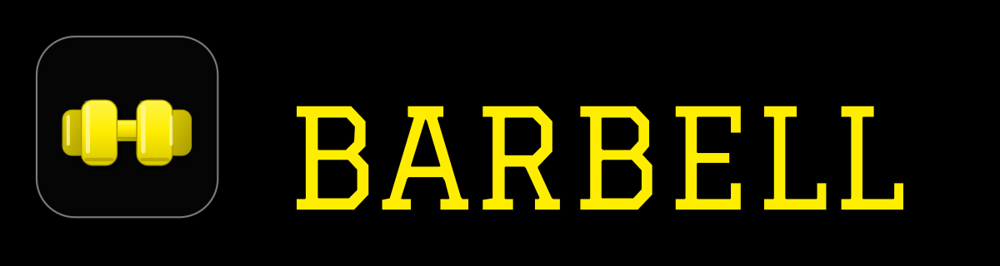

# BARBELL



**YOUR WORKOUT TRACKER** · **AI COACH & GYM TRACKER**

Barbell is an open-source workout tracker built on the [openGym project](https://github.com/DuarteSantos8/openGym). Plan your training, follow guided workouts, log sets and bodyweight, see your progress, and optionally use an AI Coach. Run the web app on your own server or use the existing Capacitor mobile code in local mode. This repository retains the upstream Git history and [GNU AGPL v3](LICENSE) license.

The Barbell rebrand is source work in progress. The upstream public site, APK and container images are **upstream releases**, not Barbell releases. There is no Barbell production domain or store download claimed here.

## How It Works

- **PLAN** — schedule weekly training and edit routines.
- **TRAIN** — follow workouts, record weights, reps, effort and timed work, and use rest timers.
- **TRACK** — keep workout history and bodyweight records.
- **PROGRESS** — review charts, estimated 1RM, activity and muscle analytics.
- **COACH** — optionally configure the existing AI Coach to propose training changes you review.
- **OWN YOUR DATA** — use local mobile storage or self-host with passkeys, sync, imports and exports.

## Features

- ⚖️ **Body-weight tracking** — interactive chart with a goal line you set, gains/losses colored by whether they move toward it
- 🏋️ **Weekly plan** — a routine per weekday, over a library of **1,324 exercises** (searchable, with animated demos), browsable **by muscle** on a body map
- ✨ **Four starter plans** — Push/Pull/Legs, Upper/Lower, Full Body, 5×5; loaded as ordinary routines you can edit, and a routine can be copied in one tap
- 🗓️ **Reschedule any day** — sick, missed a session, or fewer gym days this week? Move a workout to another day without touching your weekly plan
- 📅 **Your week starts where you say** — Monday or Sunday, in Settings. The weekly plan, the day strip on Home, the calendar and every "this week" total follow it, so the app reads the way the calendar on your wall does
- 🧭 **A workout screen that gets out of the way** — one ⋯ menu per exercise (note, details, progression, bar weight, warm-up, superset, swap, move, remove), the set number as the set's own menu (drop set, rest-pause burst, remove), and a scrollable **list view** of the whole session with the header pinned. Four switches under Settings → Workout controls bring any of the old button rows back
- 🌈 **Colour-coded RIR / RPE** — one tap logs how hard a set was, with a sentence per level ("one more rep in the tank"); the same colour whether you think in RIR or RPE, a free field for in-between values
- 📖 **History without leaving the workout** — the exercise's last sessions and a progress line, from the ⋯ menu or the exercise details
- ⭐ **Favourite exercises** — star what you use, it sorts first in the picker and the library
- ▶️ **Guided workouts** — it knows what day it is and starts today's session; asks your body weight first, pre-fills your weights from last time, rest timer, PR detection, per-exercise weight tracking. On a rest day it doesn't just say "rest day" — it names when your next session is and what it is
- 🙈 **Animations are your call** — the exercise demos can be full size, small, or hidden entirely during a workout. Hidden collapses the media rather than leaving a gap, for anyone who finds a looping GIF between sets more distracting than useful
- ☀️ **The screen stays awake while you train** — no unlocking the phone and finding your place again between every set. On for as long as a workout is running, released the moment you finish it, and switchable off in Settings
- 🔗 **Supersets** — plan them into a routine or pair two exercises *mid-session* with “make superset with previous/next”, then work through the group back-to-back with a single rest at the end of each round. Unpair at any time; a group of one dissolves itself
- 🔥 **Warm-up sets** — mark the ramp-up rows as warm-ups and they stay out of the numbers that should not see them: no effect on your estimated 1RM, your progression, or the fatigue map, while still being there in the session where you need them. A weight change cascades down the rows that share their phase, not across the divide
- ➖ **Change your mind mid-session** — add an exercise you decided to do, or remove one you didn't, without ending the workout. Removing a member of a superset asks which one
- ⏱️ **Timed exercises** — planks, hangs, wall sits and loaded carries are logged by time, not reps, with a work timer that counts the set itself (separate from the rest timer) and logs the time you actually held. They can carry weight too
- ⏲️ **Rest per exercise** — heavy triples and curls don't want the same break: give any exercise its own rest time and it overrides the global timer for that exercise (a superset rests once, taking the longest). Travels with shared plans
- 🧘 **Planned deloads** — flag a routine as excluded from automatic progression: its sessions open with the routine's own target weights, stay in your history and statistics, and never become the baseline your next regular session progresses from
- 📈 **Progression that follows a rule** — pick one per routine, override it per exercise: linear, **Greyskull LP** (AMRAP top set, double jumps, 10 % resets), double progression through a **visible rep range** (both bounds editable, per-side exercises step in twos), or adding time. Your weights are already right when the session opens, and every target says *why* it's that number. Missed reps never advance the load, stalls trigger a deload, and bodyweight exercises progress in reps instead
- 💪 **Estimated 1RM** — per exercise, from your best eligible set (it names which one), with its own progress curve and a calculator for sets you haven't done. Won't guess above 12 reps
- 🎯 **Effort per set, in your scale** — an optional third column rating how hard a set was, as **RIR** (reps left in the tank) or **RPE** (the same judgement on a 10-point scale). Off by default; each set keeps the scale it was logged with, and nothing else reads the value — your progression and 1RM are unaffected
- 💪 **Bodyweight exercises, logged as bodyweight** — push-ups, pull-ups, dips and 300-odd others arrive knowing they carry no load, so there's no weight column and no working-weight prompt: one stepper, log the reps. Add a dip belt and it reads as an addition, and progression goes back to following the weight. Without one, reps climb — and past a ceiling you set, a set is added instead of a rep, up to the point where the honest advice is load or a harder variation
- ↔️ **Reps per side** — for lunges, single-arm rows and the rest. You log the total, the app shows the split ("8 per side"), and the target steps in twos so it never lands on a number one side can't have
- 🏋️ **Plate math for barbell work** — barbell, EZ, trap bar and Smith machine carry a bar weight (20 kg / 45 lb and friends, or your own per exercise), and the workout screen tells you what goes on each side: *Bar 20 kg · 30 kg per side*. You still log the total, so your history, progression and 1RM keep meaning exactly what they always did
- 📝 **Log a past workout** — forgot your phone, trained on paper, or switched apps? Add a session after the fact from History: date, start time, duration, routine or freestyle, then the normal workout screen — weights, reps, RIR/RPE, timed sets and all. If that day already has a workout you choose: replace it, keep both, or cancel. Backfilled sessions never claim PRs against workouts that came later
- 🎲 **Freestyle sessions** — train without a plan and pick exercises as you go. Each one arrives prefilled from the last time you did it — same sets, same reps and weight by position — so an unplanned session doesn't start by asking you to retype last week
- 🏃 **Cardio** — log time + speed, not just weight × reps
- 📤 **Share a plan** — send someone your routines and week schedule as a small file (no workouts, no weigh-ins), or print it as a clean PDF. Importing merges, so their plan is never overwritten
- 🔧 **Filter by equipment** — narrow the library to what you actually own; the options adapt to what you've picked, so every combination on screen has results behind it
- ✨ **Your own exercises** — a name and a body part is enough; they behave like built-in ones everywhere, with an optional description instead of an animation
- 🟩 **Activity heatmap** — a GitHub-style year view, shaded by time spent training
- 💪 **Muscle map, three ways** — a front-and-back body diagram you can read as **Balance** (where the volume went, over a week, a month or all time — naming the muscles you *haven't* trained), **Fatigue** (what is still recovering, weighted by how close each set was to your maximum, decaying smoothly rather than expiring at a window edge) or **Strength** (how long since you trained each muscle, and behind every one the exercises that built it with their estimated 1RM). It previews what a routine hits while you build it, and shows what you just trained when you finish. Male or female figure, your pick
- 📳 **See the timer end, not just hear it** — an opt-in screen flash when a rest or work timer finishes, for loud gyms and headphones
- 🔔 **Push notifications** — rest-timer alerts even with the app closed, plus an optional reminder on days you have a workout planned but haven't logged one — on the Android app scheduled per calendar date, so a day you already trained or rescheduled stays quiet. Opt in per profile; keys are generated on first run, nothing to configure
- 🔑 **Passkeys, not passwords** — Face ID / Touch ID / fingerprint login; each profile keeps its own data, synced across devices. Sign-ins last 90 days by default (configurable), and “sign out everywhere” in Settings ends every session on every device at once
- 🛠️ **Admin dashboard** (optional) — for whoever runs the instance: who's training right now, per-user history, disable accounts, invite-only signup, and an **activity log** of sign-ins, failed attempts and admin actions. Off by default, so a fresh instance stays open with no admin
- 🎨 **Designed, not assembled** — light/dark themes and 8 accent colors saved to your profile, over a hand-drawn icon set instead of emoji, so it looks the same on every phone
- 🌍 **14 languages** — full UI translation (EN, DE, ES, FR, IT, PT (Portugal), PT (Brazil), PL, TR, RU, ZH, KO, HI, TH, HU); exercise instructions localized in 12 of them and built-in exercise names shown bilingually in PT-BR and HU, all loaded on demand so the app stays fast
- 📥 **Bring your history with you** — import from **FitNotes** (Android and iOS), **Strong** and **Hevy** (CSV or directly with a [Hevy Pro API key](https://hevy.com/settings?developer)), or body weight straight out of an **Apple Health** export. Exercise names are matched against the library and anything unrecognised becomes one of your own exercises, so nothing in the file is dropped
- 📦 **Yours to keep** — one-tap JSON export/import, guest mode, **no telemetry**; switching kg ↔ lb offers to convert every stored number
- 🤖 **Ask an AI about your training** (optional) — an [MCP server](mcp/README.md) lets a client like Claude Desktop or Cursor read your history in your own words: *"what did I bench last week?"*. Read-only, spawned locally by the client, nothing leaves your box. Not in the Docker build — if you don't use an AI assistant, it isn't there
- 🧠 **An AI coach that writes your plan** (optional, off by default) — answer a handful of questions and it designs a week of routines; later it reads what you actually logged and proposes changes, each one with the evidence behind it. You approve every change and can undo it. It runs on **your** server under **your** provider account — Anthropic, OpenAI, Gemini or any OpenAI-compatible endpoint (Ollama on your LAN counts) with a pasted API key on the default image, or the Claude Agent SDK / Codex CLI on a separate build. The phone app can use your instance or its own key. See [docs/AI_COACH.md](docs/AI_COACH.md)
- 📱 **Standalone Android source** — the Capacitor project supports local mode, native workout reminders, and the inherited update check. The existing upstream APK is an upstream release, not a Barbell build.

## AI Coach

The optional Coach can propose a training plan and revisions based on logged workouts. It is off until configured with a supported provider or a paired self-hosted server. Review proposals before applying them; the Coach does not silently replace your plan. See [the Coach guide](docs/AI_COACH.md) for providers, setup, and data sent to them.

## Your Data / Privacy

Local mobile mode stores workout data on the device. A self-hosted instance stores profiles, plans, workouts, settings, and bodyweight in JSON files under `./data`; back up that directory yourself. Passkeys authenticate server profiles, and pairing can sync a mobile device to your server. Backups and imports preserve portability. A configured AI provider receives the training context needed for Coach requests; review its setup before opting in. See [self-hosting](docs/SELF_HOSTING.md), [mobile](docs/MOBILE.md), and [the security model](SECURITY.md).

## Quick Start — Self-Host Barbell

Install Docker with Compose, then build this branch's modified source locally:

```bash
git clone https://github.com/mohammedsunainali/barbell.git
cd barbell
cp .env.example .env
docker compose up -d --build
```

Open `http://localhost:8080` and create a profile. The `media` service downloads exercise images and animations from a third-party dataset at first startup. They are **not** covered by this project's AGPL license; review [NOTICE.md](NOTICE.md) and the source terms before using or redistributing media. To access your instance from other devices with passkeys, configure HTTPS and the appropriate origin/RP settings in [the self-hosting guide](docs/SELF_HOSTING.md). Do not use `docker compose pull` to obtain a Barbell build: the compose image names still reference upstream containers.

## Architecture and development

- `frontend/`: React, Vite, Router and Zustand; the same UI runs in web and Capacitor shells.
- `api/`: Node API, WebAuthn/passkeys, JSON data files, notifications and optional Coach. [OpenAPI spec](api/openapi.yaml).
- `web/`: frontend Docker build, nginx static server and API proxy.
- `mcp/`: optional read-only stdio bridge for user training data.
- `website/`: static marketing and documentation site.

For local frontend development run `cd frontend && npm ci && npm run dev`. Tests: `cd frontend && npm test`; `cd api && npm ci && npm test`; `cd mcp && npm ci && npm test`. See [CONTRIBUTING.md](CONTRIBUTING.md), [migration audit](docs/BARBELL_MIGRATION.md), and [ROADMAP.md](ROADMAP.md).

## Mobile

The Android and iOS Capacitor projects exist in `frontend/`. Android local mode and pairing with a self-hosted instance are supported in source. There is no verified Barbell-signed APK or App Store listing yet. The native bundle/application IDs are intentionally retained for compatibility while distribution and signing are reviewed. [Mobile build instructions](docs/MOBILE.md) predate this rebrand and may contain upstream distribution links.

## Open Source

Barbell is developed from [DuarteSantos8/openGym](https://github.com/DuarteSantos8/openGym), with its commit history and existing project architecture retained. The [Barbell repository](https://github.com/mohammedsunainali/barbell) contains the modified source; no Barbell production website, signed APK, or store release is claimed here.

## Contributing

Open Barbell issues and pull requests in [this repository](https://github.com/mohammedsunainali/barbell). Run the relevant frontend, API, and MCP tests; follow [CONTRIBUTING.md](CONTRIBUTING.md) for the development workflow and compatibility rules.

## License

The inherited openGym code and modifications remain under the [GNU AGPL v3](LICENSE), subject to the original [NOTICE.md](NOTICE.md), including its additional app-store permission. Moving the repository does not change that license. The supplied Barbell identity assets are distinguished from inherited code in [the brand asset notice](assets/BARBELL_ASSETS.md).

## Third-party notices

Exercise images and animations are third-party media, not Barbell-owned and not covered by the application's AGPL. The runtime obtains them from the upstream dataset; do not redistribute or use them in Barbell marketing without checking rights. Read [NOTICE.md](NOTICE.md) for attribution, provenance, and the applicable caveats.
